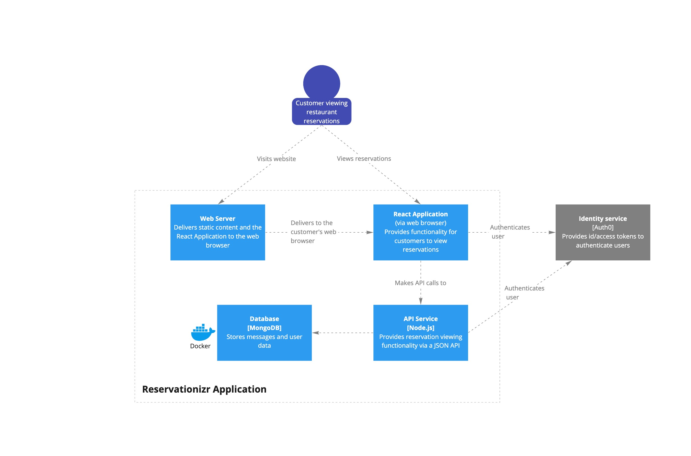
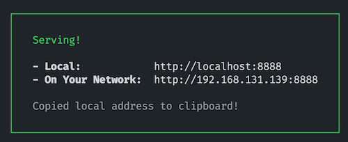
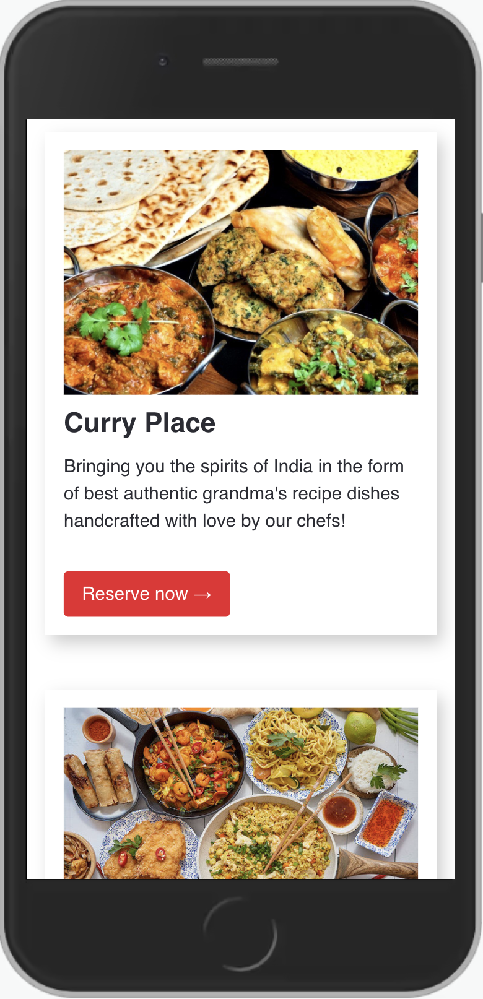
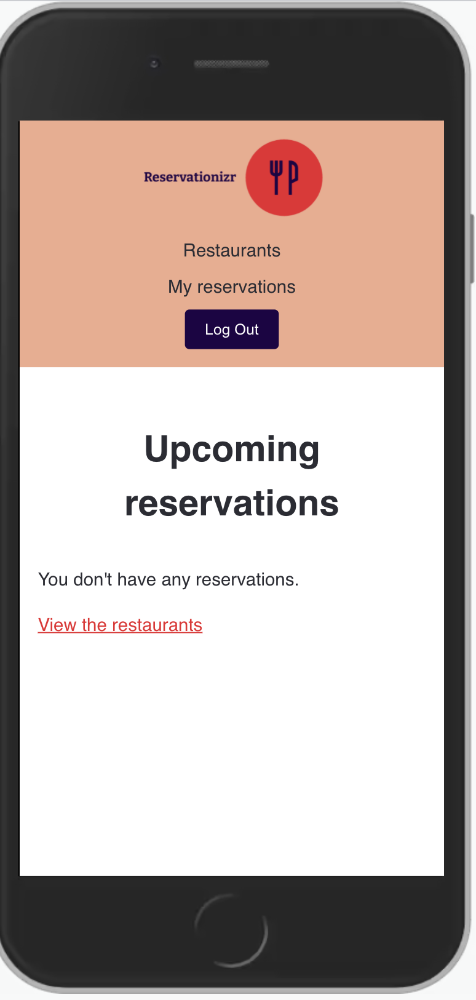
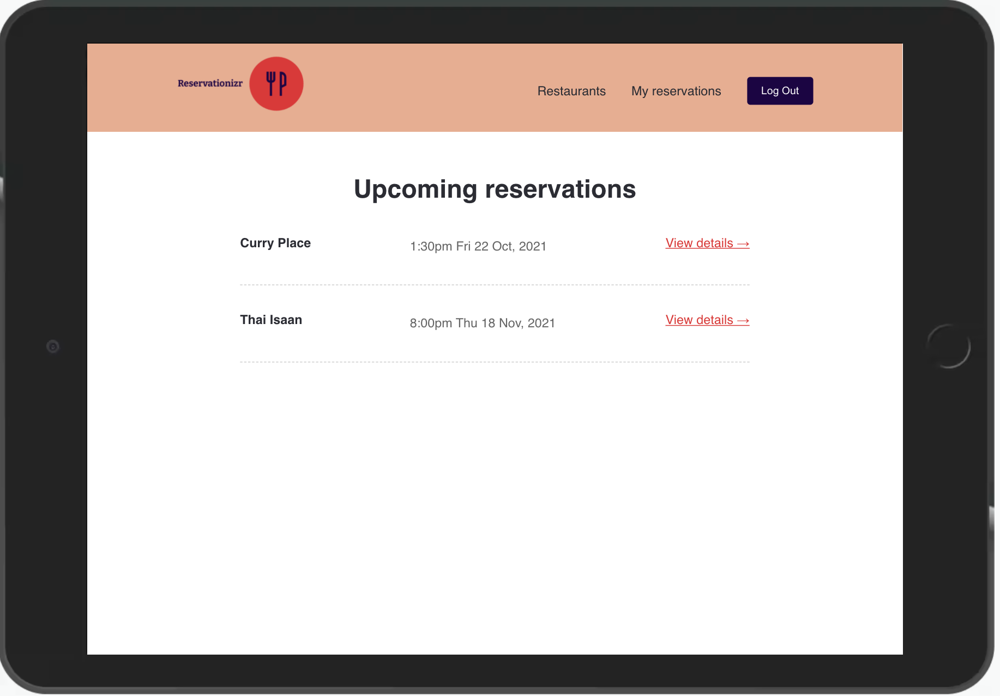

# Reservationizr Application - Manage Reservations

https://www.loom.com/share/3b8785241f664dfc9a832169d2ab4453

---

# Scenario

You are working for a new startup, Reservationizr. It allows customers to make reservations at any of their local restaurants from one place.

The previous Software Engineer started building the application but was urgently re-assigned to a different part of the business. You need to complete the remaining user stories for the web application, following the documentation below.

Your Tech Lead can support you if you need help understanding the requirements or are blocked with something in particular.

---

# Getting started

The `client` folder contains the React Application, and the `server` folder contains the Express application.

## Client

- In a new Terminal window, type: `cd client` to change directory into the client folder
- Type `npm install` to install npm dependencies
- Type `npm start` to start the React Application

## Server

- In a new Terminal window, type: `cd server` to change directory into the server folder
- Type `npm install` to install npm dependencies
- Type `npm start` to start the Express Server

## MongoDB Database

- In a new Terminal, type `docker-compose up` to start the MongoDB server in a Docker container
- Connect to MongoDB using [MongoDB Compass](https://www.mongodb.com/products/compass). Create a database named `mongo`, a collection named `restaurants`, and load data from the [data](./data) folder into the database.

---

# Architecture diagrams

---

# API specification

To view the documentation for the API specification:

1. Open a Terminal in VS Code for this project
2. Type `cd server` to change directory into the server folder
3. Type `npm run docs` to start a web server with API documentation
4. Open the link displayed in your browser (it's automatically copied to your clipboard)

   

## Load the API Specification in Insomnia

You can automatically load all the available endpoints in Insomnia.

Watch the [video tutorial](https://www.loom.com/share/dfaf8b47c6924f5ba04ce84dd1bdea1b), or follow the instructions below:

1. Go to the Insomnia Dashboard
2. Click the purple `Create` button
3. Select `File`.
4. Navigate into this exercise folder, and choose `server/e2e/api-spec.yml`.
5. Import as a `Request Collection`.
6. You can then open the Reservationizr API 1.0 Collection. Insomnia will load the endpoints for you.

---

## User Story #1 - View all restaurants

- **As a** restaurant connoisseur
- **I want** to view a list of restaurants
- **So that** I can choose the one I want to make a reservation for

### Design brief

---

## User Story #2 - View a single restaurant

- **As a** restaurant connoisseur
- **I want** to view restaurant details for a single restaurant
- **So that** I can determine if I want to reserve a table

### Design brief

---

## User Story #3 - Book a reservation

- **As a** restaurant connoisseur
- **I want** to book a reservation at a restaurant
- **So that** I can enjoy a meal at the restaurant

### Design brief

## User Story #4 - View all my reservations

- **As a** restaurant connoisseur
- **I want** to view the reservations I have made
- **So that** I can be reminded of when my next reservation is

### Design brief

---

## User Story #5 - View a single reservation

- **As a** restaurant connoisseur
- **I want** to view the details for a single restaurant reservation I have made
- **So that** I can attend the reservation

### Design brief

---

